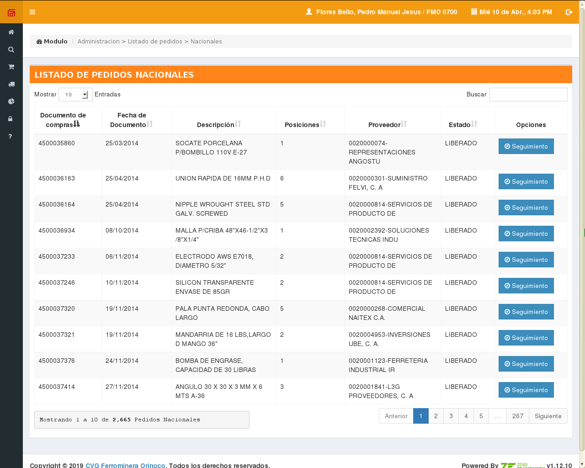

# Project Name

SAC (Sistema de Administración de Compras de Pedidos) / (Order Purchases Administratión System) 

## Project Description

This is my THESIS for university's degree Informatics Engineerin in UCAB (Universidad Catolica Andres Bello)/(Andres Bello Catholic Univesity), it gives administration panels for national and international orders purchases between the company and others.

## Technologies

- Zend Framework 1.12
- PHP
- HTML
- CSS
- PostgreSQL
- AdminLTE template

## Screenshots

Here are some screenshots of the project:

You can find more screenshots in the "screenshots" folder of this repository, also can find the Thesis document in "docs/Informe TIG - Pedro Flores.pdf" (Spanish Versión) for more information about the development of the project.